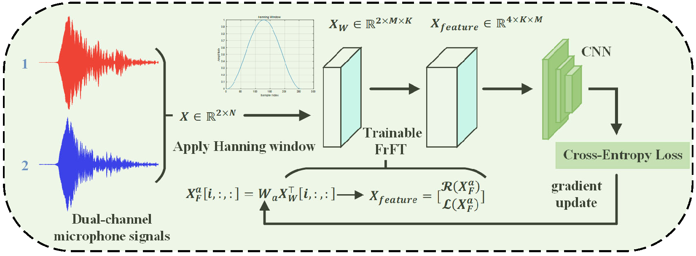

# NLOS Signal Identification for Acoustic Indoor Localization Using a Smartphone's Dual Microphones and Trainable FrFT
A PyTorch implementation of this paper.




## Usage

### Train and Test Identical-scene

To conduct experiments in the same scene, please run the following code:
```
 python -m main.train_test_identical_scene --data_path "./data/nlos_data_segmented_two_channel/" --scene_name "scene1_corridor" --num_epochs 20 --batch_size 64 --num_channels 2 --order_is_trainable --order 0.5 --feature_extraction_layer "frft" --backbone "resnet18" --model_save_path "./checkpoints_identical/"
```

### Train and Test Cross-scene
#### Train 
If you want to apply our method in the cross-scene experiment, please run the following code:
```
 python -m main.train_cross_scene --data_path "./data/nlos_data_segmented_two_channel/" --train_scene_name scene2_hall scene3_811 --num_epochs 20 --batch_size 64 --num_channels 2 --order_is_trainable --order 0.5 --feature_extraction_layer "frft" --backbone "resnet18" --model_save_path "./checkpoints_revise/"
```
#### Test 
If you want to apply our method in the cross-scene experiment, please run the following code:
```
python -m main.test_cross_scene --data_path "./data/nlos_data_segmented_two_channel/" --train_scene_name scene2_hall scene3_811 --test_scene_name scene1_corridor --batch_size 64 --num_channels 2 --order_is_trainable --order 0.5 --feature_extraction_layer "frft" --backbone "resnet18" --model_save_path "./checkpoints_revise/"
```

### Explanation of Parameters

We provide the following explanations for the parameters passed to the main function above:

- `data_path`: The path to the stored data.
- `scene_name`: The scene name used in the same scene experiment.
- `train_scene_name`: The scene name used for training in the cross-scene experiment.
- `test_scene_name`: The scene name used for testing in the cross-scene experiment.
- `num_epochs`: The number of training epochs.
- `backbone`: The architecture of the main network. 
- `batch_size`: The batch size used for training.
  - When `backbone` is set to `ResNet18`, `num_epochs` is set to 20, `batch_size` is set to 64.
  - When `backbone` is set to `ResNet34`, `num_epochs` is set to 30, `batch_size` is set to 256.
- `num_channels`: The number of input audio channels. 
  - If the value is `1`, only single-channel audio from a smartphone is used.
  - If the value is `2`, dual-channel audio from the smartphone is used.
- `feature_extraction_layer`: The feature extraction layer used. Available values are `spectrograms', 'fft` and `stft`.
- `model_save_path`: The path where the trained model will be saved.
- `order`: Specifies the order of the FrFT when `order_is_trainable` is set to `False`.

#### Special Notes for `frft` Feature Extraction

- When `feature_extraction_layer` is set to `'frft'`, two additional parameters are introduced:
  - `order_is_trainable`: Indicates whether the order of the FrFT is trainable. If you want to set it to `False`, simply remove it.
  - `only_use_real`: whether only the real part of the transformed result is used. If you want to set it to `False`, simply remove it.
  

## Acknowledgments

The trainable FrFT code is heavily based on [TrainableFrFT](https://github.com/koc-lab/TrainableFrFT)


